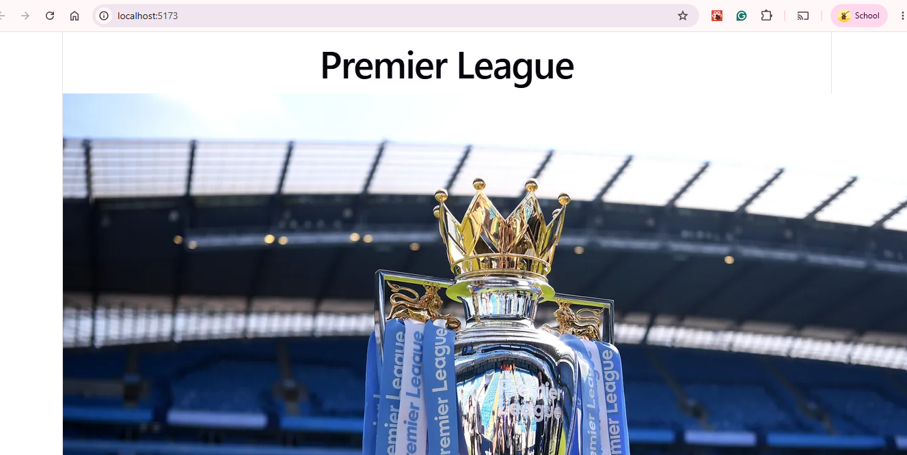
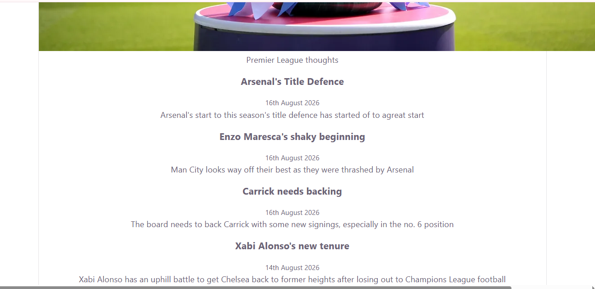

# Premier League — Personal Blog

A small React blog built out of four components: a header, an about
section, and a list of article previews.

## Component Overview

```
App
├── Header       — renders the blog name (prop: name)
├── About        — renders the logo image + about blurb (props: image, about)
└── ArticleList  — renders one Article per post (prop: posts)
    └── Article  — renders a single post's title, date, and preview
                    (props: title, date, preview)
```

| Component     | File                            | Renders inside | Renders           | Purpose                                              |
|---------------|----------------------------------|-----------------|--------------------|-------------------------------------------------------|
| `App`         | `src/App.jsx`                    | —                | Header, About, ArticleList | Root component; owns the post data and passes props down |
| `Header`      | `src/components/Header.jsx`      | App              | —                  | Displays the blog's `<h1>` title                      |
| `About`       | `src/components/About.jsx`       | App              | —                  | Displays the logo `` and an about `<p>`           |
| `ArticleList` | `src/components/ArticleList.jsx` | App              | Article (× N)      | Loops over `posts` and renders one Article per post    |
| `Article`     | `src/components/Article.jsx`     | ArticleList      | —                  | Displays one post's `<h3>` title, `<small>` date, `<p>` preview |

Each component file also has a comment block at the top with the same
info (props it expects, who renders it, what it renders) — see the
source files for details.

## Getting Started

**Requirements:** [Node.js](https://nodejs.org/) (v18+ recommended) and npm.

1. Clone or download this project, then open a terminal in the project
   folder (the one containing `package.json`).
2. Install dependencies:
   ```bash
   npm install
   ```
3. Start the local dev server:
   ```bash
   npm run dev
   ```
4. Open the URL printed in the terminal (usually
   [http://localhost:5173](http://localhost:5173)) in your browser.


*The blog's homepage — header and image.*


*A close-up of about section and article list.*